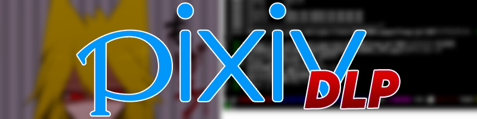

[](#readme)
___
Pixivのイラストを落とすために作った物、<BR>
実は依頼品<BR>
<BR>

## 何が出来る？
イラストをダウンロードできます
```bash
pixiv-dlp "イラストのURL"
```
また、ブックマークも取得できます
```bash
pixiv-dlp "ブクマのURL"
```
--hideを付けることで、非公開もDLできます(自分のしかダウンロードできんぞ)<BR>
cookie.txtにクッキーを書き込むことでログイン出来ます

## みなさんへ
## To everyone
## Al ĉiuj
___

このpixiv-dlpは、無断転載等を助長する為に
作ったのではなく、絵師さんの絵を個人的に
保管するために作ったものです。
よって、悪意のある利用を避けるため、
ビルド方法等は明示しません。
また、之を使用して無断転載などが発覚した場合、
即座にプライベートリポジトリ化することを
お約束します！

また、之を使用して悪意のある行為をしないでください。
基本的に、悪意のある行為は以下に集約されます：
・絵を絵師に無断でアップロードする。
・絵を友人に譲る
## <span style="color: red;">具体的に悪意のある行為がわからないなら、絶対に使わないでください！</span>

This pixiv-dlp is intended to encourage unauthorized reproduction, etc.
I didn't make it, but I personally created the artist's drawing.
It was made for storage.
Therefore, to avoid malicious use,
The build method etc. is not specified.
In addition, if unauthorized reproduction etc. using this is discovered,
Instantly make it a private repository
I promise!

Also, please do not use it for malicious purposes.
Basically, malicious acts can be summarized as follows:
・Uploading a picture without the permission of the artist.
・Give the picture to a friend

## <span style="color: red;">If you don't know the specific malicious behavior, please don't use it!</span>

Ĉi tiu pixiv-dlp celas kuraĝigi neaŭtorizitan reproduktadon ktp.
Mi ne faris ĝin, sed mi persone kreis la desegnaĵon de la artisto.
Ĝi estis farita por stokado.
Tial, por eviti malican uzon,
La konstrumetodo ktp ne estas specifita.
Krome, se malkovras neaŭtorizitan reproduktadon ktp uzante ĉi tion,
Tuj faru ĝin privata deponejo
Mi promesas!

Ankaŭ, bonvolu ne uzi ĝin por malicaj celoj.
Esence, malicaj agoj povas esti resumitaj jene:
・Alŝuti bildon sen la permeso de la artisto.
・Donu la bildon al amiko

## <span style="color: red;">Se vi ne konas la specifan malican konduton, bonvolu ne uzi ĝin!</span>